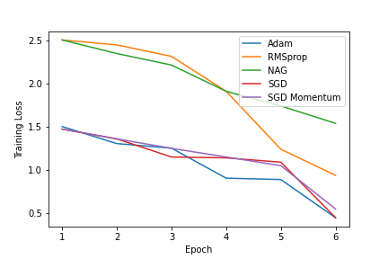
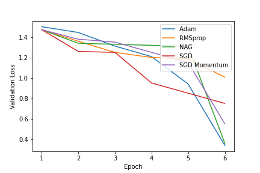

# Financial Phrase Bank Sentiment Analysis

- Built a sentiment analysis model to predict the sentiment score of a financial news article.
- The data consists of 4845 english articles that were cateogorized by sentiment class and were annotated by 16 reasearchers with a financial background.
- A BERT model was used as a baseline. The **FinBERT and DistilBERT** models were fine-tuned to get the best results.
- The best results were obtained using the fine-tuned on the FINBERT model. It achieved an **Accuracy of 90.9%** and a **F1 Score** of 0.91. 

## Data:

The Financial PhraseBank dataset consists of 4840 sentences from English language financial news categorised by sentiment. 
These sentences then were annotated by 16 people with background in finance and business.
The dataset can be downloaded from [here](https://huggingface.co/datasets/financial_phrasebank).

The dataset contains two columns  

**Sentiment**: The sentiment can be negative, neutral or positive.
 
**News Headline**: Headlines of the news articles.
Predicting the sentiment based on the news headlines.
 

## Experiments:
#### **BERT:**

- A baseline was created using the BERT model. Training the model with an **Adam optimizer with learning rate of 5e-5** for **3 epochs** yielded an **Accuracy of 86% and an F1 Score of 0.86.**

#### **DistilBERT**

- The DistilBERT model was fine tuned on the data. Training the model with an **AdamW optimizer with learning rate of 5e-5, yielded an **Accuracy of 82% and an F1 Score of 0.81.**

#### **FINBERT**

- The FINBERT model was fine tuned on the data.Training the model with an **Adam optimizer** with learning rate of 5e-5,  for **3 epochs** yielded an **Accuracy of 90.91% and an F1 Score of 0.91.**

| Model | Epochs | Accuracy | F1 Score(Weighted) |
| --- | --- | --- | --- |
| FinBERT| 3 | 90.9% | 0.91|
| BERT | 3 | 86% | 0.86|
| DistilBERT | 3 | 82% |0.81|

- We have tuned a subset of the optmization hyperparameters by running a set of trials to maximize performance over the validation set. 
- The inclusion relationships hold in all cases a more generalized optimizer never underperforms any of its specializations.
- The most general optimizers we considered were RMSprop, ADAM which do not include each other as special cases and whose relative performance is not predicted by inclusion relationships.

Optimizer    | Learning Rate $\gamma$ |   Momentum $\eta$ | Alpha $\alpha$ | Beta1 $\beta_1$ | Beta2 $\beta_2$ | Epsilon $\epsilon$ |
| ---        | ---                    | ---               | ---            | ---             | ---             | ---                |
AdamW        | 5e-5                   | 0.01              | 0.9            | 0.9             | 0.999           | 1e-5               |
RMSprop      | 0.01                   | 0.01              | 0.99           | -               | -               | 1e-5                 |
NAG          | 5e-5 |                 | -                 | -              | -               |-                | -                  |   
SGD(Momentum)| 5e-5                   | 0.001                | -              |  -           |-                | -                  |
SGD          | 0.01 |                 |      -             |     -           |       -       |    -            |     -               |

- **Adam** converged the fastest as the training loss became constant after certain epochs.

- **RMSprop** optimizer gets stuck in a local minima and takes longer to converge.

- **SGD** and **SGD with momentum** and **NAG** take longer to converge.

## Results:

The best results were obtained using a fine-tuned FinBERT model. It was used for generating the final predictions.

The results from all the text classification models have been summarized below:

| Model | Epochs | Accuracy | F1 Score(Weighted) |
| ----- | ------ | -------- | ------------------ |
| FinBERT| 3 | 90.9% | 0.91|
| BERT | 3 | 86% |0.86|
| DistilBERT | 3 | 82% |0.81|
    
The values learning rate for the adam optimizer and batch size of the model were taken from:
[[1]](https://www.researchgate.net/publication/358284785_FinancialBERT_-_A_Pretrained_Language_Model_for_Financial_Text_Mining).
[[2]](https://arxiv.org/pdf/1908.10063.pdf).

Considering the FinBERT model a detailed analysis of the optimizers used for training has been done.
The table lists out the different optimizers and their parameters used in training.

Taking inspiration of the empirical comparison of optimizers in [[3]](https://arxiv.org/pdf/1910.05446.pdf) the FinBERT model has been fine tuned on different optimizers mentioned below:  

Empirical Relations of optimizers has been used from:
[[4]](https://arxiv.org/pdf/1705.08292.pdf) 
[[5]](https://arxiv.org/pdf/1705.07774.pdf)

    
**Comparing the Training loss of all optimizers** for the fine tuned FinBERT model
 

**Comparing the Validation loss of all optimizers** for the fine tuned FinBERT model
 

The rate of convergence of the Adam optimizer is the fastest.

We can conclude the order of convergence of the optimizers:
AdamW > RMSprop > NAG > SGD (Momentum) > SGD

References:

[1] [FinancialBERT - A Pretrained Language Model for Financial Text Mining](https://www.researchgate.net/publication/358284785_FinancialBERT_-_A_Pretrained_Language_Model_for_Financial_Text_Mining)

[2] [FinBERT: Financial Sentiment Analysis with Pre-trained Language Models](https://arxiv.org/pdf/1908.10063.pdf)

[3] [On Empirical Comparisons of Optimizers for Deep Learning](https://arxiv.org/pdf/1910.05446.pdf)

[4] [The Marginal Value of Adaptive Gradient Methods in Machine Learning](https://arxiv.org/pdf/1705.08292.pdf)

[5] [Dissecting Adam: The Sign, Magnitude and Variance of Stochastic Gradients](https://arxiv.org/pdf/1705.07774.pdf)

