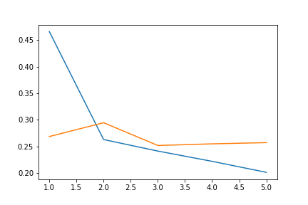
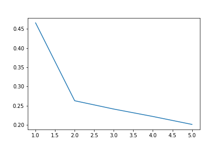
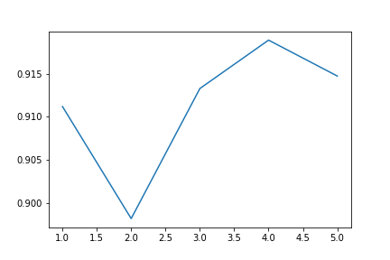

| Model | Epochs | Accuracy | F1 Score(Weighted) |
| --- | --- | --- | --- |
| FinBERT| 3 | 90.9% | 0.91|
| BERT | 3 | 86% |0.86|
| DistilBert | 3 | 76% |0.74|

| Model | Epochs | Accuracy | F1 Score(Weighted) | Optimizer | Learning Rate $\gamma$| Momentum $\eta$ | Alpha $\alpha$ |
| --- | --- | --- | --- | --- | --- | --- | --- |
| FinBERT| 3 | 90.9% | 0.91 | AdamW | 5e-5 |
| FinBERT| 3 | 90.9% | 0.91 | SGD   | 0.01 | 
| FinBERT| 3 | 90.9% | 0.91 | SGD(Momentum)| 5e-5 | 0.001|
| FinBERT| 3 | 90.9% | 0.91 | RMSprop | 0.01 | 0.01 | 0.99
| FinBERT| 3 | 91.3222% | 0.91 | Adagrad | 5e-5 |

Plotting the loss per epoch:

Plotting the log loss per epoch:

Plotting f1 score per epoch:

